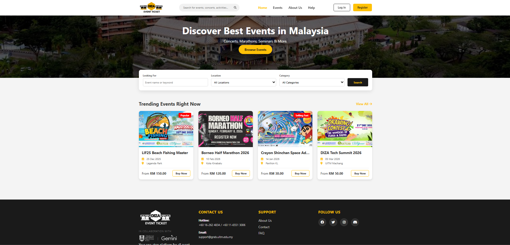

# 🎫 DIZA Event Ticket (DIZAET)

> **Your one-stop platform for all event ticketing needs.**

DIZA Event Ticket is a web-based application designed to streamline the process of managing and attending events. It provides a seamless interface for **Attendees** to book tickets and **Organizers** to manage their events, all within a secure and user-friendly environment.


## 🌟 Features

* **Role-Based Access Control:**
    * **Attendees:** Browse events, purchase tickets, and view booking history.
    * **Organizers:** Create events, manage ticket sales, and view analytics.
    * **Admins:** Manage users and oversee platform operations.
* **Secure Authentication:** Login and Registration system with role selection.
* **Interactive UI:** Modern, responsive design with interactive forms and clear navigation.
* **Dashboard:** Personalized dashboards for different user roles.

## 🛠️ Tech Stack

This project is built using the following technologies:

* **Frontend:** HTML5, CSS3, JavaScript
* **Icons:** Font Awesome 6
* **Backend:** Java Servlets, JSP (JavaServer Pages)
* **Database:** MySQL
* **Server:** Apache Tomcat 11
* **IDE:** NetBeans IDE 27 / JDK 25

## 🚀 Installation & Setup

Follow these steps to run the project locally:

1.  **Clone the repository:**
    ```bash
    git clone [https://github.com/your-username/DIZA-Event-Ticket.git](https://github.com/your-username/DIZA-Event-Ticket.git)
    ```
2.  **Database Setup:**
    * Open MySQL Workbench.
    * Create a database named `studentdb` (or your specific DB name).
    * Import the SQL file located in `database/db_schema.sql` (if available).
3.  **Open in NetBeans:**
    * Open NetBeans IDE.
    * File > Open Project > Select the cloned folder.
4.  **Configure Connection:**
    * Ensure your `DBConnection.java` file has the correct MySQL username and password.
5.  **Run:**
    * Right-click the project > **Run**.
    * The application will launch on `http://localhost:8080/DIZA-Event-Ticket`.

## 📂 Project Structure

```text
DIZA-Event-Ticket/
├── Web Pages/
│   ├── images/             # Logos and assets
│   ├── style.css           # Global stylesheets
│   ├── index.html          # Landing Page
│   ├── login.html          # Login Interface
│   ├── register.html       # Registration Interface
│   └── WEB-INF/
├── Source Packages/
│   ├── com.diza.controller # Servlets
│   ├── com.diza.model      # Java Beans
│   └── com.diza.util       # Database Connection

└── README.md
